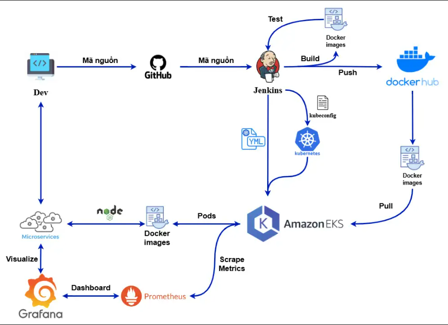

<div align="center">
  <h1>🚀 Triển Khai Ứng Dụng Microservice Trên AWS EKS</h1>
  <p><b>CI/CD Pipeline + Kubernetes + Monitoring Stack</b></p>
  <p><i>Giảng viên hướng dẫn: ThS. Lê Anh Tuấn</i></p>

  [](https://nodejs.org/)
  [](https://expressjs.com/)
  [](https://www.docker.com/)
  [](https://kubernetes.io/)
  [](https://aws.amazon.com/eks/)
  [](https://www.jenkins.io/)
  [](https://prometheus.io/)
  [](https://grafana.com/)
</div>

---

Đồ án môn **NT533.Q12 - Hệ Tính Toán Phân Bố** xây dựng và triển khai một ứng dụng web **Node.js** theo kiến trúc **Microservice** trên nền tảng đám mây **AWS**, sử dụng dịch vụ **Amazon EKS (Elastic Kubernetes Service)** để quản lý container. Hệ thống kết hợp với **Jenkins CI/CD Pipeline** để tự động hóa toàn bộ quy trình từ phát triển đến triển khai, cùng bộ giám sát **Prometheus + Grafana** cho observability.

> [!IMPORTANT]
> **MỤC TIÊU CỐT LÕI:**
> * ✅ Xây dựng ứng dụng web **Node.js + Express + EJS** với tích hợp **Prometheus metrics**
> * ✅ Đóng gói ứng dụng bằng **Docker** và đẩy image lên **Docker Hub**
> * ✅ Triển khai trên **AWS EKS Cluster** với **Multi-AZ** đảm bảo tính sẵn sàng cao
> * ✅ Thiết kế **CI/CD Pipeline** tự động hóa hoàn toàn với **Jenkins**
> * ✅ Giám sát hệ thống phân tán bằng **Prometheus** và **Grafana**

## 🏗️ Mô Hình Kiến Trúc Triển Khai (Microservice Architecture)

<div align="center">


*Mô hình kiến trúc Microservice triển khai trên AWS EKS*

</div>

Hệ thống được triển khai trên **AWS Cloud Region `us-east-1`** với các thành phần chính:

### ☁️ Hạ tầng AWS
* **VPC (Virtual Private Cloud)**: Mạng ảo riêng chứa toàn bộ hạ tầng.
* **Elastic Load Balancer (ELB)**: Cổng vào duy nhất, phân tải request đến các Pod.
* **EKS Control Plane**: Quản lý Kubernetes Cluster.

### ☸️ EKS Cluster - Multi-AZ
* **Worker Node 1** (`us-east-1a`, EC2 `t3.small`): Node.js App Pod Replica 1 + Prometheus
* **Worker Node 2** (`us-east-1b`, EC2 `t3.small`): Node.js App Pod Replica 2 + Grafana

### 📊 Monitoring Stack
* **Prometheus**: Thu thập metrics từ các App Pod (scrape `/metrics` endpoint).
* **Grafana**: Dashboard giám sát, truy vấn dữ liệu từ Prometheus.

---

## 🔄 Quy Trình CI/CD Pipeline và Giám Sát Hệ Thống

<div align="center">


*Mô hình quy trình CI/CD và Giám sát hệ thống*

</div>

### 🔨 Pipeline CI (Continuous Integration) — `Jenkinsfile.ci`

| Giai đoạn | Mô tả | Công cụ |
|---|---|---|
| **1. Checkout Code** | Lấy mã nguồn mới nhất từ Git repository | Git + Jenkins SCM |
| **2. Build & Test** | Cài đặt dependencies (`npm ci`) và chạy test (`npm test`) | Node.js + npm |
| **3. Build Docker Image** | Xây dựng Docker Image với tag `1.0.{BUILD_NUMBER}` | Docker (`--no-cache`) |
| **4. Push to Docker Hub** | Đăng nhập và đẩy image (tag phiên bản + `latest`) | Docker Hub |

### 🚀 Pipeline CD (Continuous Deployment) — `Jenkinsfile.cd`

| Giai đoạn | Mô tả | Công cụ |
|---|---|---|
| **1. Update Deployment** | Cập nhật image tag trong `deployment.yaml` | `sed` |
| **2. Apply Manifests** | Áp dụng `service.yaml` + `deployment.yaml` lên EKS | `kubectl apply` |
| **3. Rollout Restart** | Buộc khởi động lại Deployment để dùng image mới | `kubectl rollout restart` |
| **4. Verify** | Chờ rollout hoàn tất và xác nhận thành công | `kubectl rollout status` |

---

## 📂 Tổ Chức Mã Nguồn

<details>
<summary><b>Nhấn để xem Cây Thư Mục Chi Tiết</b></summary>

```text
/NT533
├── k8s/                          # Kubernetes manifests
│   ├── deployment.yaml           # Deployment config (2 replicas, Prometheus annotations)
│   └── service.yaml              # Service LoadBalancer config
├── src/                          # Source code ứng dụng
│   └── index.js                  # Entry point - Express server + Prometheus metrics
├── views/                        # EJS templates
├── Dockerfile                    # Docker image definition (node:20-alpine)
├── Jenkinsfile.ci                # CI Pipeline definition
├── Jenkinsfile.cd                # CD Pipeline definition
├── package.json                  # Node.js project config
├── package-lock.json             # Dependency lock file
├── docs/images/                  # Hình ảnh kiến trúc và quy trình
└── README.md                     # Documentation
```
</details>

---

## 🛠️ Công Nghệ Sử Dụng

| Công nghệ | Phiên bản | Vai trò |
|:---:|:---:|---|
| **Node.js** | 20-alpine | Runtime cho ứng dụng web |
| **Express** | 4.18.x | Web framework |
| **EJS** | 3.1.9 | Template engine |
| **Helmet** | 8.1.0 | Bảo mật HTTP headers |
| **prom-client** | 14.x | Prometheus metrics cho Node.js |
| **Docker** | Latest | Container hóa ứng dụng |
| **AWS EKS** | Managed K8s | Dịch vụ Kubernetes trên AWS |
| **AWS EC2** | t3.small | Worker Nodes |
| **AWS ELB** | Classic/NLB | Load Balancing |
| **Jenkins** | Latest | CI/CD Automation Server |
| **Prometheus** | Latest | Metrics collection & monitoring |
| **Grafana** | Latest | Visualization dashboard |

---

## 🚀 Hướng Dẫn Triển Khai (Getting Started)

> [!NOTE]
> Yêu cầu: AWS Account (EKS, EC2, IAM), Jenkins Server (Docker, kubectl, AWS CLI), Docker Hub account.

### Chạy Local
```bash
git clone https://github.com/Minh-Quyen-uit/NT533.git
cd NT533
npm install
npm start
# → Truy cập: http://localhost:3000
```

### Deploy lên Kubernetes
```bash
# Build Docker image
docker build -t minhquyen1325/nt533group2:latest .

# Apply manifests
kubectl apply -f k8s/service.yaml
kubectl apply -f k8s/deployment.yaml

# Kiểm tra
kubectl get pods
kubectl get svc
```

### Triển khai tự động qua Jenkins

> [!TIP]
> Cấu hình 2 Pipeline jobs trên Jenkins:
> 1. **CI Job** → trỏ đến `Jenkinsfile.ci`
> 2. **CD Job** → trỏ đến `Jenkinsfile.cd`
> 3. Cấu hình credentials: `dockerhub-credentials`, `eks-kubeconfig`, `aws-access-key`, `aws-secret-key`
> 4. Push code → CI tự động chạy → CD tự động deploy lên EKS ✅

---

## 👨‍💻 Nhóm Phát Triển (Authors)

| Họ và Tên | MSSV | Profile GitHub |
|---|:---:|---|
| Nguyễn Minh Quyền | `23521325` | [@Minh-Quyen-uit](https://github.com/Minh-Quyen-uit) |
| Bùi Đặng Nhật Nguyên | `23521037` | [@double-n-021](https://github.com/double-n-021) |

---
*Bản quyền © 2025 thuộc về Nguyễn Minh Quyền & Bùi Đặng Nhật Nguyên — Đồ Án Môn NT533.Q12 Hệ Tính Toán Phân Bố (UIT).*
