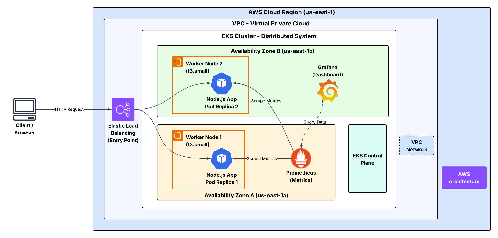
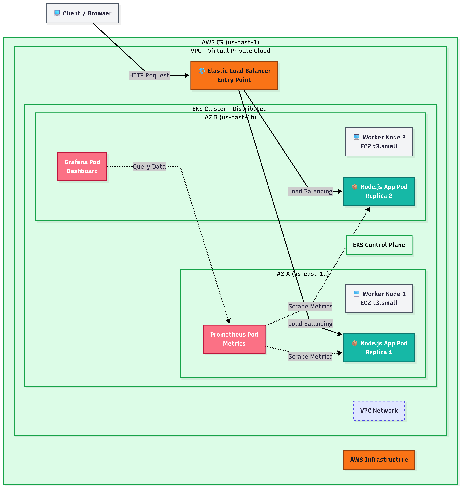
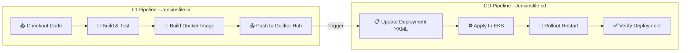
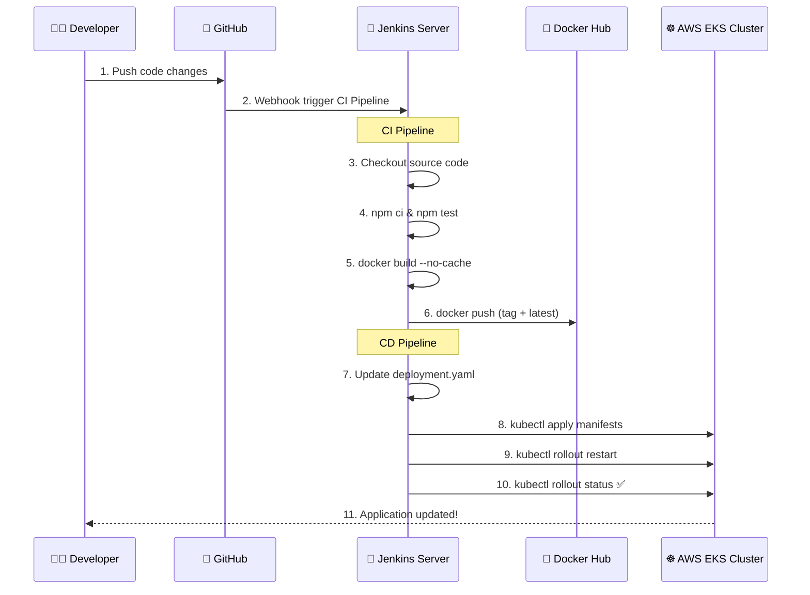

# 🚀 NT533 - Hệ Tính Toán Phân Bố | Distributed Computing System

<div align="center">


**Đồ án môn NT533.Q12 - Hệ Tính Toán Phân Bố**

*Triển khai ứng dụng Microservice trên AWS EKS với CI/CD Pipeline tự động*

</div>

---

## 📋 Thông Tin Nhóm

| Thành viên | MSSV |
|:---:|:---:|
| Thành viên 1 | 23521037 |
| Thành viên 2 | 23521325 |

**Giảng viên hướng dẫn:** Khoa Mạng Máy Tính & Truyền Thông - Trường ĐH Công nghệ Thông tin (UIT)

---

## 📖 Mô Tả Đồ Án

Đồ án xây dựng và triển khai một **ứng dụng web Node.js** theo kiến trúc **Microservice** trên nền tảng đám mây **AWS**, sử dụng dịch vụ **Amazon EKS (Elastic Kubernetes Service)** để quản lý container, kết hợp với **Jenkins CI/CD Pipeline** để tự động hóa toàn bộ quy trình từ phát triển đến triển khai.

### 🎯 Mục tiêu chính:
- ✅ Xây dựng ứng dụng web **Node.js + Express + EJS** với tích hợp **Prometheus metrics**
- ✅ Đóng gói ứng dụng bằng **Docker** và đẩy image lên **Docker Hub**
- ✅ Triển khai trên **AWS EKS Cluster** với **Multi-AZ** (đa vùng khả dụng) đảm bảo tính sẵn sàng cao
- ✅ Thiết kế **CI/CD Pipeline** tự động hóa hoàn toàn với **Jenkins**
- ✅ Giám sát hệ thống phân tán bằng **Prometheus** và **Grafana**

---

## 🏗️ Mô Hình Kiến Trúc Triển Khai

### Kiến trúc tổng quan - Microservice trên AWS EKS

<div align="center">



*Hình 1: Mô hình kiến trúc Microservice triển khai trên AWS EKS*

</div>

#### Mô tả kiến trúc:

Hệ thống được triển khai trên **AWS Cloud Region `us-east-1`** với các thành phần chính:

| Thành phần | Mô tả |
|---|---|
| **Client/Browser** | Người dùng truy cập ứng dụng thông qua trình duyệt |
| **Elastic Load Balancer (ELB)** | Cổng vào duy nhất, phân tải request đến các Pod |
| **VPC (Virtual Private Cloud)** | Mạng ảo riêng chứa toàn bộ hạ tầng |
| **EKS Cluster** | Cluster Kubernetes quản lý bởi AWS |
| **Worker Node 1 (AZ-A)** | EC2 `t3.small` tại `us-east-1a` - chạy Node.js App Pod Replica 1 + Prometheus |
| **Worker Node 2 (AZ-B)** | EC2 `t3.small` tại `us-east-1b` - chạy Node.js App Pod Replica 2 + Grafana |
| **Prometheus** | Thu thập metrics từ các App Pod (scrape) |
| **Grafana** | Dashboard giám sát, truy vấn dữ liệu từ Prometheus |

### Kiến trúc EKS Cluster - Multi-AZ

<div align="center">



*Hình 2: Chi tiết kiến trúc EKS Cluster với Multi-AZ deployment*

</div>

#### Luồng hoạt động:

```
1. Client gửi HTTP Request → Elastic Load Balancer
2. ELB phân tải (Load Balancing) → Node.js App Pod Replica 1 hoặc Replica 2
3. Prometheus scrape metrics từ tất cả App Pods
4. Grafana query dữ liệu từ Prometheus để hiển thị Dashboard
```

---

## 🔄 Thiết Kế Quy Trình Tự Động Hóa (CI/CD Pipeline)

### Tổng quan CI/CD Pipeline

Quy trình CI/CD được thiết kế với **2 Pipeline riêng biệt** trên Jenkins:



### Pipeline CI (Continuous Integration) - `Jenkinsfile.ci`

| Giai đoạn | Mô tả | Công cụ |
|---|---|---|
| **1. Checkout Code** | Lấy mã nguồn mới nhất từ Git repository | Git + Jenkins SCM |
| **2. Build & Test** | Cài đặt dependencies (`npm ci`) và chạy test (`npm test`) | Node.js + npm |
| **3. Build Docker Image** | Xây dựng Docker Image với tag phiên bản `1.0.{BUILD_NUMBER}` | Docker |
| **4. Push to Docker Hub** | Đăng nhập Docker Hub và đẩy image (tag phiên bản + `latest`) | Docker Hub |

### Pipeline CD (Continuous Deployment) - `Jenkinsfile.cd`

| Giai đoạn | Mô tả | Công cụ |
|---|---|---|
| **1. Update Deployment** | Cập nhật image tag trong `deployment.yaml` bằng `sed` | Shell |
| **2. Apply Manifests** | Áp dụng `service.yaml` và `deployment.yaml` lên EKS | `kubectl apply` |
| **3. Rollout Restart** | Buộc khởi động lại Deployment để sử dụng image mới | `kubectl rollout restart` |
| **4. Verify** | Chờ Deployment rollout hoàn tất và xác nhận thành công | `kubectl rollout status` |

### Sơ đồ luồng CI/CD chi tiết



---

## 📁 Cấu Trúc Dự Án

```
NT533/
├── 📂 k8s/                          # Kubernetes manifests
│   ├── deployment.yaml              # Deployment config (2 replicas)
│   └── service.yaml                 # Service LoadBalancer config
├── 📂 src/                          # Source code ứng dụng
│   └── index.js                     # Entry point - Express server
├── 📂 views/                        # EJS templates
├── 📂 node_modules/                 # Dependencies
├── 🐳 Dockerfile                    # Docker image definition
├── 🔧 Jenkinsfile.ci                # CI Pipeline definition
├── 🔧 Jenkinsfile.cd                # CD Pipeline definition
├── 📦 package.json                  # Node.js project config
├── 📦 package-lock.json             # Dependency lock file
└── 📖 README.md                     # Documentation
```

---

## ⚙️ Kubernetes Manifests

### Deployment (`k8s/deployment.yaml`)

```yaml
apiVersion: apps/v1
kind: Deployment
metadata:
  name: myservice
  labels:
    app: myservice
spec:
  replicas: 2                          # Chạy 2 Pods song song (Multi-AZ)
  selector:
    matchLabels:
      app: myservice
  template:
    metadata:
      labels:
        app: myservice
      annotations:                     # Prometheus scrape config
        prometheus.io/scrape: "true"
        prometheus.io/path: "/metrics"
        prometheus.io/port: "3000"
    spec:
      containers:
      - name: myservice
        image: docker.io/minhquyen1325/nt533group2:1.0.0
        imagePullPolicy: Always
        ports:
        - containerPort: 3000
        readinessProbe:                # Health check
          httpGet:
            path: /
            port: 3000
        livenessProbe:
          httpGet:
            path: /
            port: 3000
```

### Service (`k8s/service.yaml`)

```yaml
apiVersion: v1
kind: Service
metadata:
  name: myservice
spec:
  selector:
    app: myservice
  ports:
    - port: 80
      targetPort: 3000
      protocol: TCP
  type: LoadBalancer                   # Expose qua AWS ELB
```

---

## 🛠️ Công Nghệ Sử Dụng

| Công nghệ | Phiên bản | Vai trò |
|:---:|:---:|---|
| **Node.js** | 20-alpine | Runtime cho ứng dụng web |
| **Express** | 4.18.x | Web framework |
| **EJS** | 3.1.9 | Template engine |
| **Helmet** | 8.1.0 | Bảo mật HTTP headers |
| **prom-client** | 14.x | Prometheus metrics cho Node.js |
| **Docker** | Latest | Container hóa ứng dụng |
| **Kubernetes** | EKS managed | Điều phối container |
| **AWS EKS** | Managed K8s | Dịch vụ Kubernetes trên AWS |
| **AWS EC2** | t3.small | Worker Nodes |
| **AWS ELB** | Classic/NLB | Load Balancing |
| **Jenkins** | Latest | CI/CD Automation Server |
| **Prometheus** | Latest | Metrics collection & monitoring |
| **Grafana** | Latest | Visualization dashboard |
| **Docker Hub** | - | Container registry |

---

## 🚀 Hướng Dẫn Triển Khai

### Yêu cầu hệ thống

- AWS Account với quyền truy cập EKS, EC2, IAM
- Jenkins Server đã cài đặt Docker, kubectl, AWS CLI
- Docker Hub account
- `kubectl` đã cấu hình kết nối đến EKS Cluster

### Các bước triển khai

```bash
# 1. Clone repository
git clone https://github.com/Minh-Quyen-uit/NT533.git
cd NT533

# 2. Cài đặt dependencies (local development)
npm install

# 3. Chạy ứng dụng local
npm start
# → Truy cập: http://localhost:3000

# 4. Build Docker image
docker build -t minhquyen1325/nt533group2:latest .

# 5. Deploy lên Kubernetes (manual)
kubectl apply -f k8s/service.yaml
kubectl apply -f k8s/deployment.yaml

# 6. Kiểm tra trạng thái
kubectl get pods
kubectl get svc
```

### Triển khai tự động qua Jenkins

1. Tạo Jenkins Pipeline job cho **CI** → trỏ đến `Jenkinsfile.ci`
2. Tạo Jenkins Pipeline job cho **CD** → trỏ đến `Jenkinsfile.cd`
3. Cấu hình credentials trong Jenkins:
   - `dockerhub-credentials`: Username/Password Docker Hub
   - `eks-kubeconfig`: File kubeconfig EKS Cluster
   - `aws-access-key`: AWS Access Key ID
   - `aws-secret-key`: AWS Secret Access Key
4. Push code → CI tự động chạy → CD tự động deploy lên EKS

---

## 📊 Monitoring & Observability

### Prometheus
- Tự động scrape metrics từ các Pod thông qua annotations
- Endpoint: `/metrics` trên port `3000`
- Thu thập các metrics: HTTP request count, response time, memory usage, ...

### Grafana
- Dashboard trực quan hóa dữ liệu từ Prometheus
- Giám sát real-time hiệu năng hệ thống phân tán
- Alert khi phát hiện bất thường

---

## 📝 Demo

Dự án bao gồm 2 video demo:
- **Demo Deploy**: Quy trình triển khai ứng dụng lên AWS EKS
- **Demo đổi code .JS**: Minh họa CI/CD tự động khi thay đổi source code

---

## 📚 Tài Liệu Tham Khảo

- [Amazon EKS Documentation](https://docs.aws.amazon.com/eks/)
- [Kubernetes Documentation](https://kubernetes.io/docs/)
- [Jenkins Pipeline Documentation](https://www.jenkins.io/doc/book/pipeline/)
- [Prometheus Documentation](https://prometheus.io/docs/)
- [Grafana Documentation](https://grafana.com/docs/)

---

<div align="center">

**© 2025 - NT533.Q12 Group 02 - UIT**

*Hệ Tính Toán Phân Bố - Distributed Computing System*

</div>
